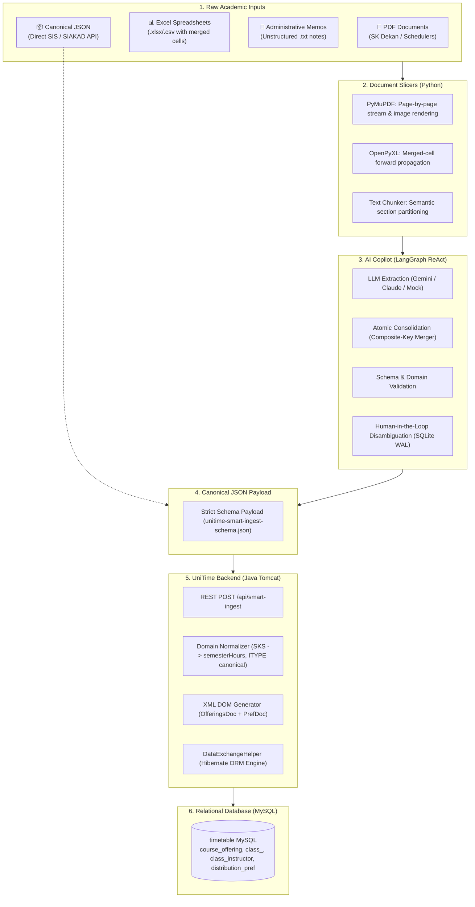

<!-- 
 * Licensed to The Apereo Foundation under one or more contributor license
 * agreements. See the NOTICE file distributed with this work for
 * additional information regarding copyright ownership.
 *
 * The Apereo Foundation licenses this file to you under the Apache License,
 * Version 2.0 (the "License"); you may not use this file except in
 * compliance with the License. You may obtain a copy of the License at:
 *
 * http://www.apache.org/licenses/LICENSE-2.0
 *
 * Unless required by applicable law or agreed to in writing, software
 * distributed under the License is distributed on an "AS IS" BASIS,
 * WITHOUT WARRANTIES OR CONDITIONS OF ANY KIND, either express or implied.
 *
 * See the License for the specific language governing permissions and
 * limitations under the License.
 * 
 -->
# UniTime

Comprehensive University Timetabling System
<https://www.unitime.org>

UniTime is a comprehensive educational scheduling system that supports developing
course and exam timetables, managing changes to these timetables, sharing rooms
with other events, and scheduling students to individual classes.
It is a distributed system that allows multiple university and departmental schedule managers
to coordinate efforts to build and modify a schedule that meets their diverse organizational
needs while allowing for minimization of student course conflicts. It can be used alone to
create and maintain a school's schedule of classes and/or exams, or interfaced with
an existing student information system. 

The system was originally developed as a collaborative effort by faculty,
students, and staff at universities in North America and Europe. The software
is distributed free under an open source license in hopes that other colleges
and universities can benefit their students through better scheduling or wish to
contribute to ongoing research in this area. The UniTime project has become
a sponsored project of the [Apereo Foundation][apereo] in March 2015.

### Components
- [Course Timetabling & Management][courses]
- [Examination Timetabling][exams]
- [Event Management][events]
- [Student Scheduling][students]
- [Instructor Scheduling][instructors]
- [AI Smart Ingestion Gateway (Fork Extension)](#-unitime-ai-smart-ingestion-gateway-fork-extension)

---

## 🤖 UniTime AI Smart Ingestion Gateway (Fork Extension)

> **Autonomous Multi-Agent Curriculum & Timetable Ingestion Engine**  
> Enables universities to ingest unstructured, semi-structured, and real-world academic data (PDF Dean Decrees / SK Dekan, messy Excel rosters with merged cells, and text memos) directly into UniTime's Course Timetabling domain model with zero data corruption.

### 🌟 Key Highlights
- **Universal Intake**: Slices and normalizes complex PDFs, merged-cell Excel spreadsheets, and unstructured narrative memos.
- **LangGraph ReAct Copilot**: Agentic curriculum extraction with Human-in-the-Loop (HITL) disambiguation and persistent SQLite WAL memory.
- **Academic Domain Mapping**: Built-in translation for higher education constructs (Indonesian SN-Dikti SKS $\rightarrow$ `semesterHours`, instructional types like `Kuliah`/`Praktikum`/`Responsi` $\rightarrow$ canonical UniTime `Lec`/`Lab`/`Rec`/`Prsn`/`Stdo`).
- **Transactional Integrity**: Native REST connector ([`SmartIngestConnector.java`](JavaSource/org/unitime/timetable/api/connectors/SmartIngestConnector.java)) integrated with UniTime's `DataExchangeHelper` and Hibernate ACID persistence.

---

### 🗺️ Data Intake Pipeline & Architecture



---

### 📥 Supported Input Formats & Processing Mechanics

| Input Format | Real-World Use Case | Slicing & Extraction Mechanism |
| :--- | :--- | :--- |
| **Excel (`.xlsx`, `.csv`)** | Faculty scheduling spreadsheets, departmental course rosters. | Evaluated via [`openpyxl`](ai-gateway/slicers/excel.py). Handles multi-level headers and automatically applies **fill-forward propagation** to merged cells so no subpart or section loses its course context. |
| **PDF (`.pdf`)** | Dean Decrees (*SK Dekan*), university course catalog books, syllabus PDFs. | Processed via [`fitz` (PyMuPDF)](ai-gateway/slicers/pdf.py). Employs single-page streaming to maintain low memory usage and prevent token context exhaustion. Supports image rendering for multimodal vision LLMs when tables are rasterized. |
| **Text Memos (`.txt`)** | Email requests from heads of programs, syllabus notes, curriculum meeting minutes. | Processed via semantic paragraph chunking ([`text.py`](ai-gateway/slicers/text.py)) to isolate individual course definitions into independent processing units. |
| **Direct JSON (`.json`)** | Direct integration from University Academic Information Systems (SIAKAD). | Bypasses slicers and LLM directly into the validator and Java REST connector. |

---

### 🔄 End-to-End Ingestion Workflow

1. **Document Ingestion & Slicing**: Raw files are ingested and broken down into atomic chunks without context loss.
2. **AI Extraction & Schema Conformance**: Each chunk is extracted into standard JSON conforming to [`unitime-smart-ingest-schema.json`](Documentation/ai-integration/unitime-smart-ingest-schema.json).
3. **Atomic Merging**: [`merger.py`](ai-gateway/core/merger.py) reconciles split configurations, subparts, and class sections across chunks using composite identity keys (`type::suffix::parentSubpartType`).
4. **Human-in-the-Loop (HITL) Disambiguation**: When instructor names or rooms are ambiguous, the LangGraph agent suspends execution to consult the human administrator. Resolutions are remembered in persistent SQLite WAL memory.
5. **REST API Transmission**: Validated payload is posted to UniTime's `/api/smart-ingest` endpoint.
6. **Backend Translation & ACID Persistence**: [`SmartIngestConnector.java`](JavaSource/org/unitime/timetable/api/connectors/SmartIngestConnector.java) maps the payload into canonical UniTime XML, imports offerings and distribution preferences through `DataExchangeHelper`, and flushes Hibernate sessions to guarantee database consistency in MySQL.

---

### 🚀 Quickstart: Running the AI Gateway

#### 1. Setup Environment
```bash
cd ai-gateway
python3 -m venv .venv
source .venv/bin/activate
pip install -r requirements.txt
cp .env.example .env
```

#### 2. Dry-Run Ingestion (Audit & Validation Only)
Simulate extraction, consolidation, and validation without writing to the database:
```bash
python ingest.py sample_inputs/memo_jadwal_if.txt
# An executive audit markdown report is generated under reports/
```

#### 3. Live Server Ingestion
Submit extracted data directly to the live UniTime server:
```bash
python ingest.py sample_inputs/jadwal_kuliah_if.xlsx --submit --unitime-url http://localhost:8888/api/smart-ingest
```

#### 4. Run Test Suite
```bash
pytest
# 77/77 tests passing (slicers, parser, merger, validator, agent, and client)
```

---

### 📚 Documentation & Reference Guides
- [AI System Prompt & Domain Mapping Matrix](Documentation/ai-integration/ai-system-prompt.md)
- [UniTime Smart Ingest JSON Schema](Documentation/ai-integration/unitime-smart-ingest-schema.json)
- [Sample Valid JSON Ingestion Payload](Documentation/ai-integration/sample-valid-payload.json)
- [Backend Java Connector Implementation](JavaSource/org/unitime/timetable/api/connectors/SmartIngestConnector.java)
- [Docker & Colima Local Setup Guide](Documentation/Docker/README.md)

### Tutorials
- [Installation Instructions][install]
- [Building UniTime][build]
- [Setting up UniTime in Eclipse][eclipse]
- [Customization][customization]
- [Localization][localization]

### Links
- [UniTime Documentation][docs]
- [Online Help][help]
- [Online Demo][demo]
- [Downloads][downloads]
- [Nightly Builds][builds]
- [XML Interfaces][xml]
- [Publications][publications]

[courses]: https://help.unitime.org/course-timetabling
[exams]: https://help.unitime.org/examination-timetabling
[events]: https://help.unitime.org/event-management
[students]: https://help.unitime.org/student-scheduling
[instructors]: https://help.unitime.org/instructor-scheduling
[help]: https://help.unitime.org
[install]: https://help.unitime.org/installation
[demo]: https://demo.unitime.org
[builds]: https://builds.unitime.org
[xml]: https://help.unitime.org/xml
[publications]: https://www.unitime.org/publications.php
[downloads]: https://sourceforge.net/projects/unitime/files
[build]: https://help.unitime.org/building-unitime
[eclipse]: https://help.unitime.org/eclipse
[docs]: https://help.unitime.org/documentation
[apereo]: https://www.apereo.org
[customization]: https://help.unitime.org/customizations
[localization]: https://help.unitime.org/localization
