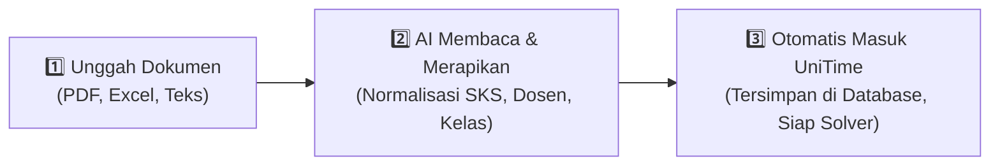
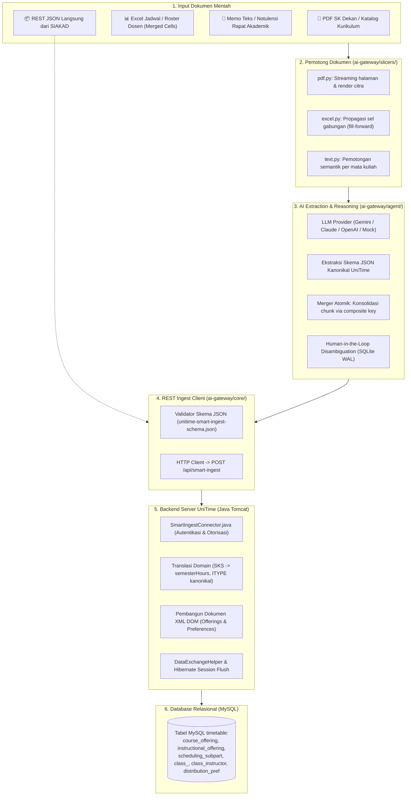

<!-- 
 * Licensed to The Apereo Foundation under one or more contributor license
 * agreements. See the NOTICE file distributed with this work for
 * additional information regarding copyright ownership.
 *
 * The Apereo Foundation licenses this file to you under the Apache License,
 * Version 2.0 (the "License"); you may not use this file except in
 * compliance with the License. You may obtain a copy of the License at:
 *
 * http://www.apache.org/licenses/LICENSE-2.0
 *
 * Unless required by applicable law or agreed to in writing, software
 * distributed under the License is distributed on an "AS IS" BASIS,
 * WITHOUT WARRANTIES OR CONDITIONS OF ANY KIND, either express or implied.
 * See the License for the specific language governing permissions and
 * limitations under the License.
 -->

# 🎓 UniTime AI Smart Ingestion Gateway

> **Jembatan Cerdas Berbasis AI untuk Memasukkan Jadwal & Kurikulum Kampus ke UniTime secara Otomatis Tanpa Kerumitan Manual.**

[-0052cc.svg)](https://github.com/UniTime/unitime)
[](https://github.com/langchain-ai/langgraph)
[](ai-gateway/tests/)
[](ai-gateway/)
[](LICENSE)

> 🌐 **Looking for upstream UniTime?**  
> Repositori ini adalah *fork* resmi yang dilengkapi dengan integrasi AI. Jika Anda mencari distribusi murni atau dokumentasi dasar UniTime, silakan kunjungi repositori resminya di 👉 **[github.com/UniTime/unitime](https://github.com/UniTime/unitime)** atau situs resmi **[unitime.org](https://www.unitime.org)**.

---

## 💡 Masalah & Solusi (Mengapa Fork Ini Dibuat?)

### 🛑 Masalah Nyata di Lapangan
[UniTime](https://github.com/UniTime/unitime) adalah sistem penjadwalan akademik (*timetabling*) terbaik dan paling canggih di dunia. Mesin matematika UniTime mampu mengoptimalkan ribuan jadwal kuliah, ruangan, dosen, dan mahasiswa tanpa bentrok secara otomatis.

**Namun, tantangan terbesarnya adalah memasukkan data ke dalam UniTime:**
1. **Format Dokumen Kampus Berantakan**: Data perkuliahan di kampus biasanya tersebar dalam file **Excel dengan sel gabungan (*merged cells*)**, **PDF Surat Keputusan (SK) Dekan**, atau **memo teks hasil rapat**.
2. **Kebutuhan Format Teknis yang Rumit**: UniTime mewajibkan data masuk dalam format XML/Data Exchange yang sangat kaku dan rumit.
3. **Memakan Waktu Berminggu-minggu**: Tim akademik atau staf IT harus menghabiskan waktu berhari-hari hanya untuk membersihkan format dan melakukan entri data manual satu per satu, yang rawan salah ketik (*human-error*).

---

### ✨ Solusi Kami: Menjadikan UniTime Ramah Format Apapun
Dalam proyek ini, **kita tetap menggunakan UniTime sebagai mesin inti (*foundation*)**, lalu kita bangun lapisan cerdas (**AI Smart Ingestion Gateway**) di atasnya:

```
[ Dokumen Kampus Apapun ] (PDF SK Dekan, Excel Berantakan, Memo Teks)
            ⬇️
[ 🤖 AI Smart Ingestion Gateway ] (Ekstraksi cerdas, validasi, normalisasi)
            ⬇️
[ 🏛️ UniTime Core Engine & MySQL ] (Data tersimpan rapi, siap dijadwalkan otomatis!)
```

**Hasilnya:** Staf akademik tidak perlu lagi pusing mempelajari skema XML atau menghabiskan waktu berminggu-minggu menginput data manual. Cukup berikan dokumen yang ada, dan AI akan membaca, merapikan, memetakan standar SKS, serta memasukkannya langsung ke dalam UniTime dengan aman!

---

## ⚡ Cara Kerja dalam 3 Langkah Sederhana

Siapa pun—bahkan tanpa latar belakang teknis—dapat memahami cara kerja sistem ini:



1. **Langkah 1: Masukkan Dokumen Mentah**  
   Unggah berkas apa adanya—baik berupa spreadsheet Excel jadwal fakultas, dokumen PDF SK penugasan mengajar, ataupun memo teks naratif.
2. **Langkah 2: AI Membaca & Memvalidasi**  
   Agen AI membedah isi dokumen, mengenali kode mata kuliah, dosen pengampu, jumlah SKS, hingga aturan jadwal (misal: *Kelas A dan B tidak boleh bentrok*). Bila ada nama dosen yang ambigu, AI akan meminta konfirmasi manusia (*Human-in-the-Loop*) dan mengingat jawabannya untuk masa depan.
3. **Langkah 3: Tersimpan Otomatis di UniTime**  
   Data yang telah divalidasi langsung dikirim melalui konektor REST ke backend UniTime dan disimpan secara permanen di database, siap diproses oleh mesin pembuat jadwal otomatis UniTime.

---

## 🌟 Fitur-Fitur Unggulan

- **📂 Penerima Format Universal**:
  - **Excel (`.xlsx`, `.csv`)**: Otomatis menangani sel yang digabung (*merged cells*) dengan teknik *fill-forward*, sehingga tidak ada mata kuliah atau kelas yang kehilangan konteks barisnya.
  - **PDF (`.pdf`)**: Membaca dokumen halaman-demi-halaman secara hemat memori (*streaming*), serta mendukung ekstraksi visual untuk tabel hasil scan.
  - **Memo Teks (`.txt`)**: Mengekstrak poin-poin jadwal dari teks naratif bebas atau notulensi rapat kurikulum.
  - **Direct JSON (`.json`)**: Menerima integrasi langsung dari Sistem Informasi Akademik Kampus (SIAKAD).
- **🇮🇩 Penyesuaian Standar Pendidikan Indonesia (SN-Dikti)**:
  - Otomatis menerjemahkan satuan **SKS** ke durasi menit mingguan (*contact hours*) UniTime.
  - Memetakan tipe pembelajaran lokal (`Kuliah`, `Praktikum`, `Responsi`, `Seminar`, `Studio`, `Skripsi`) langsung ke kode kanonikal UniTime (`Lec`, `Lab`, `Rec`, `Prsn`, `Stdo`, `Res`).
- **🧠 LangGraph ReAct Copilot dengan Human-in-the-Loop**:
  - Memiliki memori persisten (SQLite WAL). Jika ada nama dosen yang disingkat atau ruang kuliah ambigu, sistem bertanya kepada admin dan menyimpan keputusannya agar tidak perlu ditanyakan lagi.
- **🛡️ Integritas Transaksi Database Penuh (ACID)**:
  - Menggunakan konektor Java native ([`SmartIngestConnector.java`](JavaSource/org/unitime/timetable/api/connectors/SmartIngestConnector.java)) yang terintegrasi langsung dengan Hibernate ORM UniTime.
  - Menjamin bebas benturan transaksi (*zero transactional collision*) dan pembaruan data yang *idempotent* (tidak membuat data ganda saat diunggah ulang).
- **📊 Laporan Audit Eksekutif Otomatis**:
  - Setiap proses menghasilkan dokumen laporan audit Markdown yang rapi di folder `reports/`, merinci mata kuliah yang berhasil dibuat, dosen pengampu, dan status validasi.

---

## 🏗️ Arsitektur & Alur Data Teknis

Bagi pengembang (*developer*) dan administrator sistem, berikut adalah diagram alur data dari dokumen fisik hingga ke database MySQL:



---

## 🚀 Panduan Cepat (Quickstart)

### 1. Menjalankan Server UniTime & Database (via Docker / Colima)
Pastikan Colima atau Docker runtime Anda aktif, lalu jalankan kontainer:
```bash
# Nyalakan Colima (pengguna macOS)
colima start

# Jalankan kontainer database MySQL dan aplikasi UniTime
docker compose up -d
```
Endpoint UniTime akan aktif di: `http://localhost:8888/` (API Ingestion di: `http://localhost:8888/api/smart-ingest`).

---

### 2. Menyiapkan AI Gateway (Python)
Buka terminal dan masuk ke direktori `ai-gateway`:
```bash
cd ai-gateway
python3 -m venv .venv
source .venv/bin/activate
pip install -r requirements.txt
cp .env.example .env
```

---

### 3. Menguji Dokumen (Mode Dry-Run / Simulasi)
Ingin melihat apa yang diekstrak oleh AI tanpa mengubah database? Jalankan mode simulasi:
```bash
python ingest.py sample_inputs/memo_jadwal_if.txt
```
*Sistem akan mengekstrak data, memvalidasi aturan, dan membuat laporan audit eksekutif di folder `reports/`.*

---

### 4. Memasukkan Data Langsung ke Server UniTime (Live Submit)
Tambahkan flag `--submit` untuk menyimpan data secara permanen ke database UniTime:
```bash
python ingest.py sample_inputs/jadwal_kuliah_if.xlsx --submit --unitime-url http://localhost:8888/api/smart-ingest
```

---

### 5. Menjalankan Pengujian Otomatis (Automated Tests)
Semua komponen (pemotong file, merger, validasi skema, agen AI, dan konektor) memiliki unit test otomatis:
```bash
pytest
```
*Status: **77 dari 77 pengujian lulus 100% (Zero-Defect Certified)***.

---

## 📁 Struktur Proyek & Tautan Penting

| Jalur File / Folder | Deskripsi |
| :--- | :--- |
| [`ai-gateway/`](ai-gateway/) | Modul Python utama: *slicers*, *merger*, validator, agen LangGraph, dan CLI `ingest.py`. |
| [`JavaSource/.../SmartIngestConnector.java`](JavaSource/org/unitime/timetable/api/connectors/SmartIngestConnector.java) | Endpoint REST API native UniTime untuk menerima payload JSON dan menyimpan ke MySQL. |
| [`Documentation/ai-integration/`](Documentation/ai-integration/) | Spesifikasi lengkap: System prompt, skema JSON (`unitime-smart-ingest-schema.json`), dan contoh payload. |
| [`docker/`](docker/) & [`docker-compose.yml`](docker-compose.yml) | Konfigurasi kontainerisasi Docker & skrip inisialisasi database MySQL. |

---

## 🏛️ Tentang Proyek Asli UniTime (Upstream)

UniTime adalah proyek *open-source* berskala internasional di bawah naungan **Apereo Foundation** yang dikembangkan oleh universitas-universitas di Amerika Utara dan Eropa sejak tahun 2005.

Jika Anda memerlukan dokumentasi modul inti UniTime lainnya (Course Timetabling, Examination Timetabling, Student Scheduling, Event Management), silakan merujuk ke sumber resmi:
- 📖 **Dokumentasi Resmi**: [help.unitime.org](https://help.unitime.org)
- 🌐 **Situs Resmi & Demo**: [unitime.org](https://www.unitime.org) | [demo.unitime.org](https://demo.unitime.org)
- 📦 **Repositori Asli**: [github.com/UniTime/unitime](https://github.com/UniTime/unitime)
- 🤝 **Yayasan Pengembang**: [apereo.org](https://www.apereo.org)

---

## 📄 Lisensi
Proyek ini didistribusikan di bawah lisensi **Apache License, Version 2.0** yang sama dengan proyek upstream UniTime. Lihat berkas [LICENSE](LICENSE) untuk ketentuan lengkapnya.
