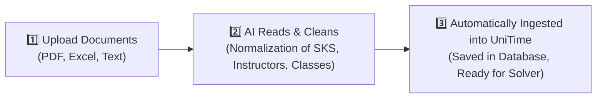
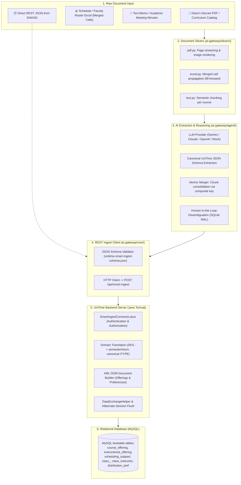

<!-- 
 * Licensed to The Apereo Foundation under one or more contributor license
 * agreements. See the NOTICE file distributed with this work for
 * additional information regarding copyright ownership.
 *
 * The Apereo Foundation licenses this file to you under the Apache License,
 * Version 2.0 (the "License"); you may not use this file except in
 * compliance with the License. You may obtain a copy of the License at:
 *
 * http://www.apache.org/licenses/LICENSE-2.0
 *
 * Unless required by applicable law or agreed to in writing, software
 * distributed under the License is distributed on an "AS IS" BASIS,
 * WITHOUT WARRANTIES OR CONDITIONS OF ANY KIND, either express or implied.
 * See the License for the specific language governing permissions and
 * limitations under the License.
 -->

# 🎓 UniTime AI Smart Ingestion Gateway

> **An AI-Powered Smart Bridge for Ingesting Campus Schedules & Curricula into UniTime Automatically Without Manual Hassle.**

[-0052cc.svg)](https://github.com/UniTime/unitime)
[](https://github.com/langchain-ai/langgraph)
[](ai-gateway/tests/)
[](ai-gateway/)
[](LICENSE)

> 🌐 **Looking for upstream UniTime?**  
> This repository is an official fork equipped with AI integration. If you are looking for the pure distribution or core documentation of UniTime, please visit its official repository at 👉 **[github.com/UniTime/unitime](https://github.com/UniTime/unitime)** or the official website **[unitime.org](https://www.unitime.org)**.

---

## 💡 Problem & Solution (Why This Fork Was Created)

### 🛑 Real-World Problem in the Field
[UniTime](https://github.com/UniTime/unitime) is the world's most advanced and comprehensive academic scheduling (*timetabling*) system. UniTime's mathematical engine is capable of automatically optimizing thousands of course schedules, rooms, instructors, and students without conflicts.

**However, the biggest challenge lies in ingesting data into UniTime:**
1. **Messy Campus Document Formats**: Campus course data is typically scattered across **Excel files with merged cells**, **Dean's Decree (SK) PDFs**, or **text memos from meetings**.
2. **Complex Technical Format Requirements**: UniTime mandates incoming data in a very rigid and complex XML/Data Exchange format.
3. **Takes Weeks of Effort**: Academic teams or IT staff must spend days just cleaning up formats and doing manual data entry one by one, which is prone to human error (*typos*).

---

### ✨ Our Solution: Making UniTime Friendly to Any Format
In this project, **we keep UniTime as the core engine (*foundation*)**, and build an intelligent layer (**AI Smart Ingestion Gateway**) on top of it:

```
[ Any Campus Document ] (Dean's Decree PDF, Messy Excel, Text Memo)
            ⬇️
[ 🤖 AI Smart Ingestion Gateway ] (Intelligent extraction, validation, normalization)
            ⬇️
[ 🏛️ UniTime Core Engine & MySQL ] (Data neatly stored, ready for automatic scheduling!)
```

**The Result:** Academic staff no longer need to struggle with learning XML schemas or spend weeks manually entering data. Simply provide the existing documents, and the AI will read, clean, map credit unit (SKS) standards, and insert them directly into UniTime securely!

---

## ⚡ How It Works in 3 Simple Steps

Anyone—even without a technical background—can understand how this system works:



1. **Step 1: Input Raw Documents**  
   Upload files as they are—whether faculty schedule Excel spreadsheets, teaching assignment decree PDFs, or narrative text memos.
2. **Step 2: AI Reads & Validates**  
   The AI agent analyzes document contents, recognizing course codes, instructors, credit hours (SKS), up to scheduling constraints (e.g., *Class A and B must not overlap*). If an instructor name is ambiguous, the AI prompts for human confirmation (*Human-in-the-Loop*) and remembers the decision for the future.
3. **Step 3: Automatically Saved in UniTime**  
   Validated data is directly transmitted via REST connector to the UniTime backend and permanently saved in the database, ready to be processed by UniTime's automated timetable solver.

---

## 🌟 Key Features

- **📂 Universal Format Ingestion**:
  - **Excel (`.xlsx`, `.csv`)**: Automatically handles merged cells using a *fill-forward* technique, ensuring no course or class loses its row context.
  - **PDF (`.pdf`)**: Reads documents page-by-page with memory efficiency (*streaming*), and supports visual extraction for scanned tables.
  - **Text Memos (`.txt`)**: Extracts schedule points from freeform narrative text or curriculum meeting minutes.
  - **Direct JSON (`.json`)**: Accepts direct integration from Campus Academic Information Systems (SIAKAD).
- **🇮🇩 Indonesian Higher Education Standard Adaptation (SN-Dikti)**:
  - Automatically translates **SKS** (credit units) into UniTime weekly contact hours (minutes).
  - Maps local instructional types (`Kuliah`, `Praktikum`, `Responsi`, `Seminar`, `Studio`, `Skripsi`) directly to canonical UniTime codes (`Lec`, `Lab`, `Rec`, `Prsn`, `Stdo`, `Res`).
- **🧠 LangGraph ReAct Copilot with Human-in-the-Loop**:
  - Equipped with persistent memory (SQLite WAL). If an instructor name is abbreviated or a classroom is ambiguous, the system queries the administrator and persists the decision so it never has to ask again.
- **🛡️ Full Database Transaction Integrity (ACID)**:
  - Uses a native Java connector ([`SmartIngestConnector.java`](JavaSource/org/unitime/timetable/api/connectors/SmartIngestConnector.java)) integrated directly with UniTime's Hibernate ORM.
  - Guarantees zero transactional collisions and idempotent data updates (no duplicate records upon re-upload).
- **📊 Automated Executive Audit Reports**:
  - Every run produces a clean Markdown audit report in the `reports/` directory, detailing successfully created courses, assigned instructors, and validation statuses.

---

## 🏗️ Technical Architecture & Data Flow

For developers and system administrators, here is the data flow diagram from physical documents down to the MySQL database:



---

## 🚀 Quickstart Guide

### 1. Running UniTime Server & Database (via Docker / Colima)
Ensure your Colima or Docker runtime is active, then launch the containers:
```bash
# Start Colima (macOS users)
colima start

# Run MySQL database and UniTime application containers
docker compose up -d
```
The UniTime endpoint will be active at: `http://localhost:8888/` (Ingestion API at: `http://localhost:8888/api/smart-ingest`).

---

### 2. Setting Up AI Gateway (Python)
Open a terminal and navigate to the `ai-gateway` directory:
```bash
cd ai-gateway
python3 -m venv .venv
source .venv/bin/activate
pip install -r requirements.txt
cp .env.example .env
```

---

### 3. Testing Documents (Dry-Run / Simulation Mode)
Want to preview what the AI extracts without modifying the database? Run simulation mode:
```bash
python ingest.py sample_inputs/memo_jadwal_if.txt
```
*The system will extract data, validate rules, and generate an executive audit report in the `reports/` directory.*

---

### 4. Ingesting Data Directly into UniTime Server (Live Submit)
Add the `--submit` flag to permanently persist data into the UniTime database:
```bash
python ingest.py sample_inputs/jadwal_kuliah_if.xlsx --submit --unitime-url http://localhost:8888/api/smart-ingest
```

---

### 5. Running Automated Tests
All components (file slicers, merger, schema validation, AI agent, and connector) have automated unit tests:
```bash
pytest
```
*Status: **77 of 77 tests passing 100% (Zero-Defect Certified)***.

---

## 📁 Project Structure & Key Links

| File / Folder Path | Description |
| :--- | :--- |
| [`ROADMAP.md`](ROADMAP.md) | **Current status, active tasks, and upcoming deployment & frontend roadmap.** |
| [`ai-gateway/`](ai-gateway/) | Core Python module: *slicers*, *merger*, validator, LangGraph agent, and `ingest.py` CLI. |
| [`JavaSource/.../SmartIngestConnector.java`](JavaSource/org/unitime/timetable/api/connectors/SmartIngestConnector.java) | Native UniTime REST API endpoint for receiving JSON payloads and persisting to MySQL. |
| [`Documentation/ai-integration/`](Documentation/ai-integration/) | Complete specification: System prompt, JSON schema (`unitime-smart-ingest-schema.json`), and sample payloads. |
| [`docker/`](docker/) & [`docker-compose.yml`](docker-compose.yml) | Docker containerization configuration & MySQL database initialization scripts. |

---

## 🏛️ About the Upstream UniTime Project

UniTime is an international open-source project under the auspices of the **Apereo Foundation**, developed by universities across North America and Europe since 2005.

If you require documentation for other core UniTime modules (Course Timetabling, Examination Timetabling, Student Scheduling, Event Management), please refer to official sources:
- 📖 **Official Documentation**: [help.unitime.org](https://help.unitime.org)
- 🌐 **Official Website & Demo**: [unitime.org](https://www.unitime.org) | [demo.unitime.org](https://demo.unitime.org)
- 📦 **Original Repository**: [github.com/UniTime/unitime](https://github.com/UniTime/unitime)
- 🤝 **Foundation**: [apereo.org](https://www.apereo.org)

---

## 📄 License
This project is distributed under the **Apache License, Version 2.0**, identical to the upstream UniTime project. See the [LICENSE](LICENSE) file for complete terms.
