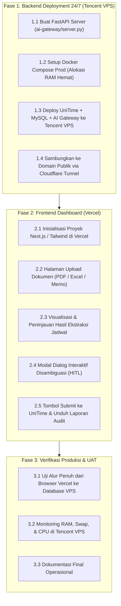

# 🗺️ Project Status & Roadmap: UniTime AI Smart Ingestion

Dokumen ini adalah **sumber kebenaran tunggal (*Single Source of Truth*)** mengenai status perkembangan proyek, apa yang telah selesai dicapai, apa yang sedang dikerjakan saat ini, dan tahapan apa saja yang akan kita lakukan selanjutnya.

---

## 📌 Status Terkini Proyek (Executive Summary)

- **Fondasi Inti**: UniTime v4.8 (Java 17, Tomcat 10.1, Hibernate, MySQL 8.3)
- **Lapisan AI**: Python AI Ingestion Gateway (LangGraph ReAct, PyMuPDF, OpenPyXL, SQLite WAL Memory)
- **Status Kode**: **Production-Ready Core Engine** (78/78 Unit & Integration Tests Passing)
- **Target Arsitektur**: **Hybrid Cloud Deployment**
  - **Backend (24/7)**: Host di **Tencent Cloud VPS** (`tencent-vps.hanavy.online`)
  - **Frontend (Web UI)**: Host di **Vercel** (Next.js Dashboard)

---

## ✅ 1. Apa yang SUDAH SELESAI Dilakukan (Completed Milestones)

| Milestone | Ruang Lingkup | Status & Bukti Empiris |
| :--- | :--- | :---: |
| **M1: Spesifikasi Skema & Prompt** | Perancangan JSON Schema kanonikal UniTime (`unitime-smart-ingest-schema.json`), pemetaan standar SN-Dikti Indonesia, dan dokumentasi system prompt AI. | ✅ **100% Selesai** |
| **M2: Slicers & Parser Dokumen** | Modul pemotong file: PDF streaming (PyMuPDF), Excel normalisasi sel gabungan *fill-forward* (OpenPyXL), dan pemotong teks semantik. | ✅ **100% Selesai** |
| **M3: Agen AI LangGraph ReAct** | Ekstraksi terstruktur, *composite-key merger* (`type::suffix::parentSubpartType`), validasi skema ketat, dan memori persisten SQLite WAL untuk *Human-in-the-Loop* (HITL). | ✅ **100% Selesai** |
| **M4: Backend Connector Java** | Implementasi [`SmartIngestConnector.java`](JavaSource/org/unitime/timetable/api/connectors/SmartIngestConnector.java) di endpoint `/api/smart-ingest`. Mengeliminasi benturan transaksi Hibernate, translasi SKS $\rightarrow$ `semesterHours`, dan translasi tipe pengajaran (`Kuliah` $\rightarrow$ `Lec`, `Praktikum` $\rightarrow$ `Lab`, dll.). | ✅ **100% Selesai** |
| **M5: Live End-to-End MySQL Testing** | Pengujian data riil ke container MySQL `timetable`. Berhasil menyimpan penawaran MK, kelas paralel, dosen, dan batasan distribusi secara *idempotent* dan bebas duplikasi. | ✅ **100% Selesai** (Commit `1f29255`) |
| **M6: GitHub Documentation & CI Prep** | Perombakan `README.md` ramah pengguna, migrasi cabang `master` $\rightarrow$ `main`, dan penambahan dukungan Custom LLM Base URL (OpenRouter, Ollama, AI Proxy). | ✅ **100% Selesai** (Commit `c8f188a`) |

---

## 🔄 2. Apa yang SEDANG KITA LAKUKAN Saat Ini (In Progress)

Saat ini kita sedang mempersiapkan **Infrastruktur Backend 24/7 di Tencent Cloud VPS** dan merancang antarmuka untuk **Frontend Vercel**:

1. **Audit & Optimasi Sumber Daya VPS Tencent**:
   - Status terkini: RAM tersedia **1.2 GiB** dan Swap bebas **3.3 GiB** (ruang bernapas sudah aman).
   - Menyiapkan alokasi memori hemat (*Resource Diet*): Tomcat JVM disetel ke `-Xms256m -Xmx768m`, dan MySQL buffer pool disetel ke `128M`.
2. **Merancang REST API Server untuk AI Gateway (FastAPI)**:
   - Menjembatani Vercel dengan engine UniTime di VPS.
   - Menyediakan endpoint upload file agar Vercel tidak terputus limit *serverless* (10 detik).
3. **Persiapan Pipeline Deployment Gambar Docker (CI/CD)**:
   - Menghindari kompilasi Maven berat di VPS (yang berisiko memakan sisa disk 6 GB) dengan memanfaatkan GitHub Actions atau build pra-paket.

---

## 🚀 3. Apa Saja yang AKAN KITA LAKUKAN (Upcoming Roadmap)

Rencana kerja selanjutnya dibagi menjadi 3 fase terstruktur:

---

### 📦 Rincian Langkah-Langkah Kerja:

#### 🔹 Fase 1: Backend Deployment 24/7 di Tencent VPS
- [x] **1.1 Wrapper REST API FastAPI**:
  Membuat file `ai-gateway/server.py` yang menyediakan endpoint upload, polling status, resolusi ambigu, healthcheck, submit, dan audit reports.
- [x] **1.2 Konfigurasi Docker Produksi (`docker-compose.prod.yml`)**:
  Menyusun konfigurasi kontainer dengan limit memori hemat (`-Xms256m -Xmx768m`, buffer pool 128M) dan restart policy `unless-stopped`.
- [x] **1.3 Deployment ke Tencent VPS**:
  Menjalankan 3 layanan Docker (MySQL 8.3, UniTime Tomcat v4.8, AI Gateway) di VPS Tencent secara *healthy* 24/7.
- [x] **1.4 Ekspos Domain & SSL**:
  Menghubungkan endpoint FastAPI ke Nginx reverse proxy SSL di `https://tencent-vps.hanavy.online/unitime-api`.
- [x] **1.5 Integrasi Real LLM (Antigravity Gateway)**:
  Menghubungkan AI Gateway ke live engine Antigravity Gateway port 8080 dengan model `gemini-flash-latest`.

---

#### 🔹 Fase 2: Pembangunan Frontend di Vercel (Next.js)
- [x] **2.1 Setup Proyek Web**:
  Next.js 14 App Router, Tailwind CSS, Lucide Icons di direktori `web/`.
- [x] **2.2 Komponen Drag & Drop Upload**:
  Multi-file support (`.pdf`, `.xlsx`, `.csv`, `.txt`, `.json`) dengan opsi provider & model override.
- [x] **2.3 Interactive Curriculum & Visual Timetable**:
  Tabel visual mata kuliah dan grid visual jadwal mingguan interaktif (07:00–21:00).
- [x] **2.4 Human-in-the-Loop Dialog & Split-View Chat**:
  UI modal interaktif untuk resolusi konflik kapasitas/waktu serta streaming penalaran AI (*Reasoning Stream*).
- [x] **2.5 One-Click Live Commit & Audit Inspector**:
  Tombol pengiriman akhir ke database UniTime dan inspeksi modal laporan audit Markdown & JSON.
- [x] **2.6 Keamanan Enterprise BFF Proxy**:
  Route internal `/api/*` menyembunyikan API key & backend URL dari browser, dilengkapi `AdminAccessModal` dengan sandi master.
- [x] **2.7 Deployment Vercel**:
  Deploy produksi aktif di `https://unitime-rho.vercel.app` terintegrasi CI/CD Git GitHub `main`.

---

#### 🔹 Fase 3: User Acceptance Testing (UAT) & Monitoring
- [x] **3.1 Pengujian End-to-End Realistis**:
  Alur penuh terverifikasi: Login `mahasiswaCS25` &rarr; upload dokumen &rarr; ekstraksi live AI (`gemini-flash-latest`) &rarr; validasi skema 100% valid &rarr; sinkronisasi data ke UniTime database.
- [ ] **3.2 Monitoring Stabilitas Rutin**:
  Memantau stabilitas memori RAM Tencent VPS tetap di bawah 1.5 GB selama pengoperasian berkelanjutan.
