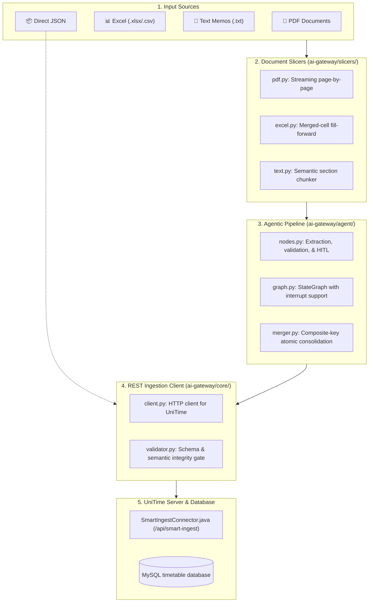

# 🎓 UniTime AI Ingestion Gateway

The **UniTime AI Ingestion Gateway** is an autonomous, multi-agent AI copilot and automated data extraction pipeline that converts messy academic documents (PDF schedules, multi-level merged-cell Excel spreadsheets, and unstructured memos) into canonical, validated UniTime course timetabling data.

---

## 🌟 Key Features

1. **Multi-Format Document Slicing**:
   - `PyMuPDF` (`fitz`): Single-page streaming pipeline for high-volume catalogs and rasterized PDF schedules.
   - `openpyxl`: Header-aware Excel parser featuring automatic **merged-cell forward propagation** to eliminate dropped course context.
   - Narrative Chunker: Semantic boundary segmentation for freeform text memos and email directives.
2. **LangGraph ReAct Agent**:
   - Structured JSON output conforming to `unitime-smart-ingest-schema.json`.
   - **Human-in-the-Loop (HITL)** disambiguation interrupt for unresolvable instructor names or scheduling conflicts.
   - **Persistent Memory**: SQLite WAL-mode state persistence (`memory_context`) ensuring administrative resolutions are permanently remembered.
3. **Composite-Key Merger**:
   - Consolidates atomic chunks using composite identity tuples (`type::suffix::parentSubpartType`) to prevent subpart overwrites.
4. **Domain Translation Matrix**:
   - Seamlessly converts Indonesian Higher Education (SN-Dikti) standards (SKS -> `semesterHours`, `Kuliah`/`Praktikum`/`Responsi` -> canonical UniTime `Lec`/`Lab`/`Rec`/`Prsn`/`Stdo`).
5. **ACID Hibernate REST Integration**:
   - Sends validated payloads directly to the native `SmartIngestConnector` (`/api/smart-ingest`) on Tomcat.

---

## 🏗️ Architecture & Data Pipeline



---

## 🚀 Installation & Quickstart

### 1. Prerequisites
- Python 3.10+ (tested up to Python 3.14)
- Docker / Colima with running UniTime container

### 2. Environment Setup
```bash
python3 -m venv .venv
source .venv/bin/activate
pip install -r requirements.txt
cp .env.example .env
```

### 3. Usage Commands

#### Dry-Run Mode (Extract, Validate & Audit Report)
Inspect what the AI extracted without modifying the UniTime database:
```bash
python ingest.py sample_inputs/memo_jadwal_if.txt
# Generates a detailed audit markdown report in reports/
```

#### Live Ingestion Mode (Submit to UniTime Server)
Extract and persist offerings, classes, and constraints to the database:
```bash
python ingest.py sample_inputs/jadwal_kuliah_if.xlsx --submit --unitime-url http://localhost:8888/api/smart-ingest
```

#### Command-Line Flags
| Flag | Default | Description |
| :--- | :--- | :--- |
| `input_path` | *(required)* | Path to the source document (PDF, XLSX, CSV, TXT, JSON). |
| `--provider` | `mock` | LLM provider: `mock`, `gemini`, `anthropic`, or `openai`. |
| `--model` | `auto` | Specific model identifier (e.g. `gemini-1.5-pro`, `claude-3-5-sonnet-20241022`). |
| `--submit` | `False` | Submits the validated payload to the UniTime live server when present. |
| `--unitime-url` | `http://localhost:8888/api/smart-ingest` | Base URL of the UniTime Smart Ingest API. |
| `--dry-run` | `True` | Runs extraction and local audit without committing to the live server. |
| `--strict` | `False` | Enforces strict schema validation (warnings treated as blocking errors). |
| `--reports-dir` | `reports/` | Directory where executive audit markdown reports are saved. |

---

## 🧪 Testing Suite

Run the full automated test suite:
```bash
pytest
```
*Current test suite: **77/77 passing tests** covering slicers, parser, validator, merger, client, and LangGraph agent execution.*
